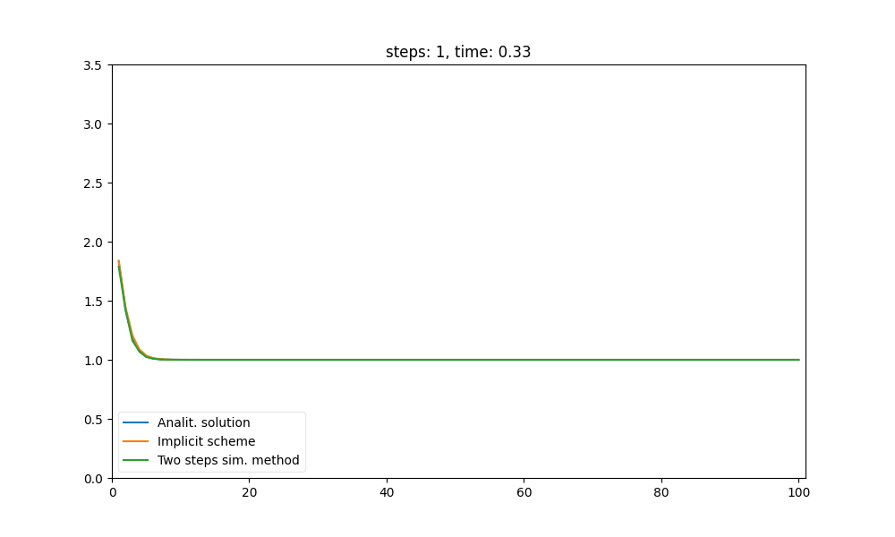
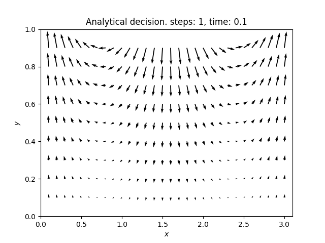
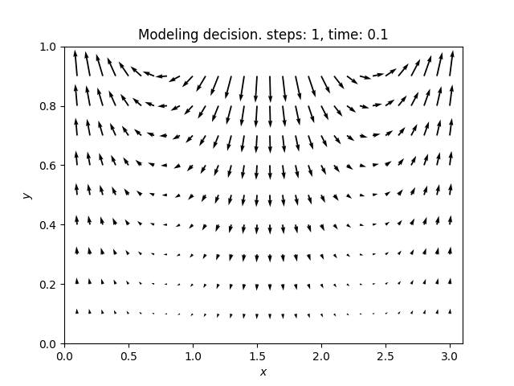

# Лабораторные работы по предмету "Численное моделирование динамики систем"

- [Лабораторные работы по предмету "Численное моделирование динамики систем"](#лабораторные-работы-по-предмету-численное-моделирование-динамики-систем)
  - [Лабораторная №1 "Численное моделирования для уравнения теплопроводности"](#лабораторная-1-численное-моделирования-для-уравнения-теплопроводности)
    - [Л1. Постановка задачи](#л1-постановка-задачи)
    - [Л1. Использование программы](#л1-использование-программы)
      - [Л1. Создание методов](#л1-создание-методов)
      - [Л1. Рисунки](#л1-рисунки)
  - [Лабораторная №2 "Численное решение уравнения Бюргерса"](#лабораторная-2-численное-решение-уравнения-бюргерса)
    - [Л2. Постановка задачи](#л2-постановка-задачи)
    - [Л2. Использование программы](#л2-использование-программы)
    - [Л2. Результат анимации](#л2-результат-анимации)
  - [Лабораторная №3 "Численное моделирование вязкой ньютоновской несжимаемой жидкости"](#лабораторная-3-численное-моделирование-вязкой-ньютоновской-несжимаемой-жидкости)
    - [Л3. Постановка задачи](#л3-постановка-задачи)
    - [Л3. Использование программы](#л3-использование-программы)
      - [Анимация](#анимация)
      - [Ошибки и странности](#ошибки-и-странности)

## Лабораторная №1 "Численное моделирования для уравнения теплопроводности"

- [Код работы](lab1/main.py)
- [Отчет pdf](lab1/report/report.pdf)
- [Отчет tex](lab1/report/report.tex)

### Л1. Постановка задачи

Было дано уравнение теплопроводности с двумя пространственными переменными и краевыми условиями первого рода. Необходимо было реализовать 3 разностных алгоритма:
1. явная разностная схема
2. метод переменных направлений
3. двухшаговый симметризированный алгоритм

Также были даны аналитические решения уравнения теплопроводности. Необходимо было при помощи данного аналитического решения вычислить правую часть уравнения теплопроводности. А после, получив численное приближение решения, вычислить абсолютную ошибку.

### Л1. Использование программы

Основные параметры задаются в блоке, что идет после `if __name__ =="__main__":`

Вот пример параметров
<!-- Cspell:disable -->
```py
    x_lim = [0,1]
    y_lim = [0,1]
    h = 0.1

    t_0 = 0
    tau = h**2/4
    t = t_0

    steps = 100

    params = {
        'a':0.1,
        'A': 1,
        'k1':1,
        'k2':1,
    }
```
<!-- Cspell:enable -->

здесь:

- `x_lim`, `y_lim` - ограничения по соответствующим координатам.
- `h` - шаг разностной схемы по пространству. Он един для оси x и оси y
- `t_0` - начальное значение времени
- `tau` - шаг разностной схемы по времени. В примере он задан так, чтобы явная разностная схема была стойкой
- `steps` - количество шагов разностной схемы
- `t` - параметр, который отображает текущее время для разностной схемы


Нужно задать аналитическое решение и аналитически вычисленную правую часть. Вот пример для варианта 1.

<!-- Cspell:disable -->
```py
def analytical_solution_1(x,y,t, **params):
    """
    Это аналитаческое решение (w) для вар 1
    в функцию по своему желанию можно передавать именованные параметры 
    a="value",
    A="value",
    k1="value",
    k2="value"
    если ничего не передано,то идет значения по умолчанию: все равны 1
    """
    a = params.get("a") or 1
    A = params.get("A") or 1
    k1 = params.get("k1") or 1
    k2 = params.get("k2") or 1
    
    return A*np.exp(k1*x + k2*y + (k1**2 + k2**2)*a*t)
    
def analytical_f_1(x,y,t,**params):
    """
    Аналитически вычисленная правая часть по аналитическому решению
    В случае вар. 1 это просто 0
    """
    a = params.get("a") or 1
    A = params.get("A") or 1
    k1 = params.get("k1") or 1
    k2 = params.get("k2") or 1
    return np.zeros(x.shape)
```
<!-- Cspell:enable -->

Функции принимают `x`, `y` и `t`. Причем `x`, `y` - это numpy-массивы, а `t` - это число. `params` - это константные параметры для функций.

В основном блоке есть словарь `params` в котором перечисленны параметры для функций. 

#### Л1. Создание методов

В этом блоке кода показано, как создаются методы

<!-- Cspell:disable -->
```py
cond= BoundaryConditions_first_type(x_lim,y_lim,t_0, analytical_solution_1, **params)

x= np.arange(*x_lim, step =h)[1:]
y= np.arange(*y_lim, step =h)[1:]

method1 = MethodExplicitDifferenceScheme(x,y,cond, h, tau, analytical_f_1, **params )
method2 = AlternatingDirectionMethod(x,y,cond, h, tau, analytical_f_1, **params)
method3 = Double_strandedSymmetrizedAlgorithm(x,y,cond, h, tau, analytical_f_1, **params)

# список методов, которые для которых будет вычислена ошибка
method_list = [method1,method2, method3]
```
<!-- Cspell:enable -->

1. В начале создается объект, который отвечает за краевые условия: `BoundaryConditions_first_type`
2. Создаются массивы `x`,`y`, по которым будет строится сетка разностных методов. Стоит заметить, что `x`,`y` не включат крайних точек, это сделано, потому что разностная сетка строится по тим точкам, а крайние точки считаются в `BoundaryConditions_first_type`.
3. Создается объект явной разностной схемы (`MethodExplicitDifferenceScheme`).
4. Создается объект метода переменных направлений (`AlternatingDirectionMethod`)
5. Создается объект двухшагового симметризированного алгоритма (`Double_strandedSymmetrizedAlgorithm`)

У объектов методов есть 2 метода:
- `__call__` (вызов метода как функцию). Возвращает сетку значений разностной схемы на текущем шаге.
- `update`. Обновление разностной схемы (шаг по времени).

***
**В списке `method_list` записаны те методы, которые будут запущены.** Из него можно убирать методы и добавлять. Для тестов можно увеличить параметр `tau`, что испортит стойкость явной разностной схемы, тогда можно просто убрать этот метод из списка и программа запустит только остальные два.
***

#### Л1. Рисунки

Программа делает 3 графика. 
- график абсолютной ошибки
- график абсолютной ошибки с логарифмической шкалой по оси ошибки
- график аналитического решения в конечный момент времени.

Вот код, что это делает
<!-- Cspell:disable -->
```py
error_graphic(time_list, methods_error_list, title= "Абсолютна похибка")
error_graphic(time_list, methods_error_list, title= "Абсолютна похибка log шкала", log_scale=True)

solution_graphic(xv,yv,[analytical_solution_1(xv,yv,t, **params)], title="Аналітичний розв'язок")
plt.show()
```
<!-- Cspell:enable -->

Функция `error_graphic` принимает список временных отметок и список списков с абсолютными ошибками методов. По умолчанию методы нумеруются начиная с 1, но можно ввести свои обозначения (параметр функции `methods_labels`).


## Лабораторная №2 "Численное решение уравнения Бюргерса"

- [Код работы](lab2/main.py)
- [Отчет pdf](lab2/report/report.pdf)
- [Отчет tex](lab2/report/report.tex)

### Л2. Постановка задачи

Дано уравнение Бюргерса. Необходимо реализовать алгоритмы для его численного решения
- Неявную разностную схему
- Двухшаговый симметризированный алгоритм. Стоит заметить, что в моей реализации возникают осцилляции при некоторых изменениях параметров вычислительного эксперимента. Не знаю, моя ли это ошибка, либо это проблемы метода и недостатки представления чисел в компьютере.

После этого провести вычислительный эксперимент при заданных параметрах, вывести графики решения, значения абсолютной ошибки. Для численного эксперимента даны основные параметры, а также аналитическое решение уравнения.

### Л2. Использование программы

Программа работает схожем образом с [первой лабораторной](#л1-использование-программы). Многие обозначения повторяются. 

Основной функцией является `main_plots_and_errors`. Эта принимает параметры

- `x_lim` - ограничения по соответствующим координатам.
- `h` - шаг разностной схемы по пространству.
- `t_0` - начальное значение времени
- `tau` - шаг разностной схемы по времени. В примере он задан так, чтобы явная разностная схема была стойкой
- `steps_list` - Список, что содержит количества шагов по времени. Для каждого из элементов этого списка будет создан график решения уравнения в указанный момент времени. Также для каждого элемента списка будет создан столбец в таблице ошибок.
- `nsize=1` - необязательный параметр, который может влиять на размер графика
- `delimiter= ' & '` - необязательный параметр для формирования таблицы со значениями абсолютной ошибки, это строка, которая разделяет значения в таблице ошибок.
- `decimal_places= 4` - это параметр, что используется для округления значений в таблице ошибок. Также он влияет на количество знаков после запятой в значении времени на графиках
- `plots_names= None` - это необязательный параметр. Это список с подписями графиков решения. Он должен содержать 3 строки:
    1. Подпись аналитического решения
    2. Подпись для неявной разностной схемы
    3. Подпись для двухшагового симметризированного алгоритма
- `**params` - словарь, что содержит константы для аналитического решения, методов, граничных условий. Похожий параметр уже использовался в первой лабораторной работе.

Функция возвращает:
- график, где в строке находятся 2 рисунка, а количество рисунков в столбце изменяется в зависимости от размера `steps_list`.
- выводит таблицу ошибок в стандартный вывод.

Дополнительно есть функция для создания анимации `anim_plots`. Ее параметры похожи на параметры предыдущей функции, опишем те, что отличаются

- `step` - значение количества шагов по времени для алгоритмов. Хорошо подходит `step=160`. Также это число отвечает за количество кадров в анимации.
- `y_lim = (-0.5, 3.5)` - необязательный параметр. Он отвечает за размер оси ординат в анимации. По умолчанию настроен на значения для численного эксперимента из лабораторной.
-  `name = 'res_animation.gif'` - название `gif` файла, куда будет сохранена анимация
-  `figsize = None` - необязательный параметр, что отвечает за размер картинки. Неплохо себя показывает значение `(10,6)`.
-  `decimal_places= 2` - необязательный параметр, отвечает за количество знаков после запятой в значениях времени.

При создании анимации возможны ошибки. В таком случае попробуйте изменить команду сохранения:

<!-- Cspell:disable -->
```py
anim.save(name)
# если выдает ошибки попробуйте
# anim.save(name, writer='pillow')
```
<!-- Cspell:enable -->

### Л2. Результат анимации




## Лабораторная №3 "Численное моделирование вязкой ньютоновской несжимаемой жидкости"

- [Код работы](lab3/main.py)
- [Отчет pdf](lab3/report/report.pdf)
- [Отчет tex](lab3/report/report.tex)

### Л3. Постановка задачи

Для моделирования дано линеаризованную систему уравнений Навье-Стокса. Также дано точное решение. Необходимо построить динамику изменений векторного поля скоростей, а также динамику изменения давления. Сравнить численное решение с точным.

### Л3. Использование программы

Программа работает схожем образом с [первой](#л1-использование-программы) и [второй](#л2-использование-программы) лабораторными. Многие обозначения повторяются. 

Основной функцией является `main_and_error_plots`. Она принимает параметры

- ` x_lim` - ограничения по оси *x* (ось абсцисс)
- `y_lim` - ограничения по оси *y* (ось ординат)
- `hx` - шаг разностной схемы по оси *x*
- `hy` - шаг разностной схемы по оси *y*
- `t_0` - начальное значение времени
- `tau` - шаг разностной схемы по времени
- `steps` - количество шагов по времени, что сделает схема. Будут выведены графики в этот момент времени
- `first_moment = 1` - необязательный параметр. Значение должно быть меньше `steps`. Функция выводит графики в момент когда прошло `first_moment` шагов, он будет показан над графиками в момент когда прошло `steps` шагов. Советую брать `first_moment` небольшим, поскольку скорости быстро гасятся. 
- `nsize = 1` - необязательный параметр, который может влиять на размер графика
- `cmap_name = 'viridis'` - цветовая карта. Влияет на вид графика (каким цветом обозначено давление). Список цветовых карт можно найти по этой [ссылке](https://matplotlib.org/stable/tutorials/colors/colormaps.html)
- `**params` - словарь, что содержит константы для аналитического решения, методов, граничных условий. 


Функция возвращает 2 рисунка.
- Первый рисунок -- это демонстрация скорости и давления.Цветом обозначено давление. Стрелками обозначена скорость в точке. Я некоторым образом изменил масштаб скорости, чтобы она выглядела аккуратно. За это внутри функции отвечает этот параметр:
<!-- Cspell:disable -->
```
my_scale = int(np.max(np.abs(analytical_u(xv,yv,t_0))) *10)
```
<!-- Cspell:enable -->
- Второй рисунок -- это график абсолютной ошибки в *u*, *v*, *p* (составляющая скорости по *x*,составляющая скорости по *y*, давление). Ось абсцисс -- количество шагов, ось ординат -- абсолютная ошибка

#### Анимация

Функция для создания анимации `anim_plots`. Ее параметры похожи на параметры предыдущей функции, опишем те, что отличаются
- `name_analit = 'analit_anim.gif'` - название файла анимации для аналитического решения
- `name_model = 'model_anim.gif'` - название файла для численного решения
- `decimal_places= 2` - округление времени на подписях к графикам
- `figsize = None` - необязательный параметр, что отвечает за размер картинки.

Анимация демонстрирует изменение поля скоростей. На анимации нет давления.





#### Ошибки и странности

В лабораторной работе для обновления давления *p* используется метод верхней релаксации [Роуч П. Вычислительная гидродинамика. М. “Мир” 1980. с-616.]. Но у меня при малых значениях параметра *tau* (шаг по времени) возникают ошибки при вычислении *p*. Это подробнее описано в отчете. Поэтому лучше, чтобы значение параметра *tau* было приблизительно равно *hx* (шаг по оси *x*). 

Для демонстрации этой ошибки я сделал функцию `plot_for_errors_in_lab`. Она не требуется для сдачи лабораторной работы.